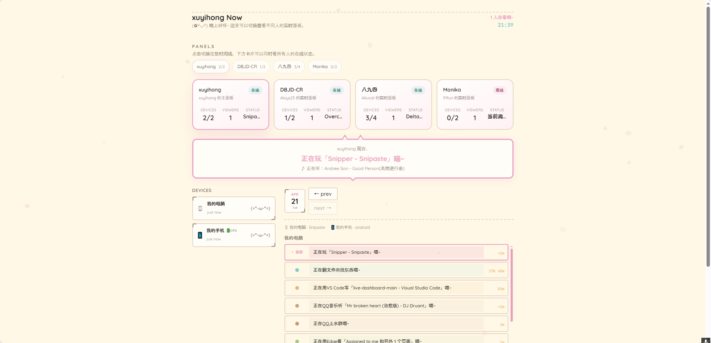

# Live Dashboard

实时设备活动仪表盘 — 公开展示你正在使用的应用，拥有二次元风格 UI 和隐私优先设计。当前默认站点名已经改成 xuyihong，并支持在同一个页面聚合查看多个人的 Live Dashboard。

在线演示：https://xuyihong.icu/（QQ交流群1093496287，可以反馈问题和闲聊）

## 截图

**当前版本界面预览**



## 特色

- 猫耳装饰的视觉小说风格对话框 + 中文戏剧化活动描述
- 飘落的樱花花瓣动画，夜间自动切换萤火主题
- 三级隐私系统（SHOW / BROWSER / HIDE）保护敏感窗口标题
- 系统托盘常驻 + AFK 检测（看视频/听歌时自动豁免）
- 音乐检测（Spotify、QQ音乐、网易云等）
- Health Connect 健康数据同步（Android）
- 多设备多平台支持（Windows / macOS / Android）

## Windows PowerShell + Docker 部署（推荐）

这套步骤按顺序复制即可。默认使用 3000 端口，先跑起来，再按需修改。

### 0. 前置准备

1. 安装 Docker Desktop（Windows）并确保 Docker 已启动。
2. 打开 PowerShell（建议管理员权限）。
3. 确认 Docker 可用：

```powershell
docker --version
docker compose version
```

### 1. 一键启动（单设备示例，使用当前仓库代码构建）

```powershell
# 1) 生成密钥
# 每台设备需要一个独立的设备密钥，另外还需要一个服务端密钥。

# Linux / macOS：
# 设备密钥（每台设备各生成一个，记下来）
# openssl rand -hex 16
# HASH_SECRET（服务端内部用，只需一个）
# openssl rand -hex 32

# Windows（PowerShell）：
# 设备密钥
$TOKEN = -join((1..16)|%{'{0:x2}'-f(Get-Random -Max 256)})
# HASH_SECRET
$SECRET = -join((1..32)|%{'{0:x2}'-f(Get-Random -Max 256)})

# 2) 切到仓库目录（按你的实际路径修改）
Set-Location D:\live-dashboard-main

# 3) 创建数据卷（首次执行一次即可）
docker volume create dashboard_data

# 4) 用当前源码构建镜像
docker build -t live-dashboard:local .

# 5) 启动容器
docker rm -f live-dashboard
docker run -d --name live-dashboard `
  -p 3000:3000 `
  -v dashboard_data:/data `
  -e "HASH_SECRET=$SECRET" `
  -e "DEVICE_TOKEN_1=$TOKEN:my-pc:我的电脑:windows" `
  live-dashboard:local

# 6) 启动检查
docker ps --filter "name=live-dashboard"
Invoke-WebRequest http://127.0.0.1:3000/api/health -UseBasicParsing

# 7) 记录 token（给 Agent 使用）
Write-Host "DEVICE_TOKEN_1 = $TOKEN"
```

浏览器打开：http://127.0.0.1:3000

### 2. 常用运维命令（PowerShell）

```powershell
# 查看日志
docker logs --tail 100 live-dashboard
docker logs -f live-dashboard

# 重启容器
docker restart live-dashboard

# 停止并删除容器（不会删除数据卷）
docker rm -f live-dashboard

# 删除数据（谨慎，执行后历史数据清空）
docker volume rm dashboard_data
```

### 3. 常见问题排查

1. 报错 `invalid reference format`：多数是引号/换行符错误，确保在 PowerShell 中使用反引号续行。
2. 页面无数据：检查 Agent 是否填了正确 token；检查 `DEVICE_TOKEN_N` 中的 `device_id` 是否唯一。
3. 端口占用：把 `-p 3000:3000` 改成 `-p 3001:3000`，并访问 `http://127.0.0.1:3001`。

## Docker Compose 部署（推荐生产化）

### 1. 准备配置文件

```powershell
Set-Location D:\live-dashboard-main
Copy-Item .env.example .env -Force

# 本项目默认使用外部网络 + 固定 IP，请先创建（仅首次）
docker network create --driver bridge --subnet 172.20.0.0/24 your_external_network
```

说明：仓库内的 `docker-compose.yml` 默认走本地构建（`build: .`），会使用你当前代码；
`docker-compose.example.yml` 是官方预构建镜像示例，不建议在你这个定制版本里直接覆盖使用。
### 2. 编辑 `.env`

至少配置以下变量：

```env
DEVICE_TOKEN_1=token1:my-pc:我的电脑:windows
DEVICE_TOKEN_2=token2:my-phone:我的手机:android
HASH_SECRET=请替换成64位随机十六进制
DISPLAY_NAME=xuyihong
SITE_TITLE=xuyihong Now
SITE_DESC=What is xuyihong doing right now?
SITE_FAVICON=/favicon.ico
EXTERNAL_DASHBOARDS=[{"id":"aloys23","name":"DBJD-CR","url":"https://livedashboard.aloys23.link"},{"id":"ailucat","name":"八九四","url":"https://live.ailucat.top"},{"id":"fun91","name":"Monika","url":"https://live.91fun.asia"}]
```

### 3. 启动 Compose

```powershell
# 可选：先做配置体检，避免启动后才报错
docker compose config -q

docker compose up -d
docker compose ps
Invoke-WebRequest http://127.0.0.1:3000/api/config -UseBasicParsing
```

### 4. 更新镜像

```powershell
docker compose up -d --build
```

### 5. Compose 常见错误与处理

1. 报错变量未设置（例如 `The "HASH_SECRET" variable is not set`）
  - 原因：`.env` 不存在或变量没填。
  - 处理：确认仓库根目录存在 `.env`，并至少填写 `DEVICE_TOKEN_1`、`HASH_SECRET`。

2. 报错网络不存在（`network your_external_network not found`）
  - 原因：还没创建外部网络。
  - 处理：执行 `docker network create --driver bridge --subnet 172.20.0.0/24 your_external_network`。

3. 报错子网不匹配（`no configured subnet contains IP address 172.20.0.80`）
  - 原因：外部网络存在，但子网不是 `172.20.0.0/24`。
  - 处理：删除后按正确子网重建：
    `docker network rm your_external_network`
    `docker network create --driver bridge --subnet 172.20.0.0/24 your_external_network`

4. 报错容器名冲突（`Conflict. The container name "/live_dashboard" is already in use`）
  - 原因：已有同名容器在运行或残留。
  - 处理：`docker rm -f live_dashboard` 后再启动 Compose。

5. 报错端口占用（`bind: address already in use`）
  - 原因：3000 端口已被其他容器或进程占用。
  - 处理：释放 3000，或把 `docker-compose.yml` 里的 `ports` 改为 `3001:3000`。

6. 明明重启了但页面还是旧数据
  - 常见原因：访问到了另一套旧容器（同机多个容器都在跑）。
  - 处理：先 `docker ps` 核对映射端口和容器名，再访问对应端口；必要时停掉旧容器。

7. 已删卷但仍看到旧设备
  - 常见原因：删错卷名（Compose 卷通常带项目名前缀），或前端看到的是外部面板数据。
  - 处理：使用 `docker compose down -v` 清理本项目卷，并确认 `EXTERNAL_DASHBOARDS` 配置是否包含外部站点。

## 多面板部署（一个站点看多人）

多面板核心是 `EXTERNAL_DASHBOARDS`，它是一个 JSON 数组。每一项至少包含 `id`、`name`、`url`。

作用：

1. **一个入口看多人**：在同一个页面切换查看自己和朋友/团队成员的 Live Dashboard，不用分别开多个网页。
2. **快速对比状态**：首页卡片会同时展示各面板在线设备数、状态摘要，方便你快速知道谁在线、谁离线。
3. **降低维护成本**：每个人可以保留自己的独立部署与数据，你只需要在主面板维护一份 `EXTERNAL_DASHBOARDS` 列表。
4. **适合展示场景**：适合社群主页、团队状态墙、个人导航页做聚合展示，不会把多人的数据混写到同一个数据库。

工作方式：

1. 本站通过 `/api/proxy` 读取外部站点的 `api/config`、`api/current`、`api/timeline`。
2. 默认不会写入外部站点数据到本地数据库，只做读取和展示。
3. 某个外部站点不可达时，只影响该站点卡片，不影响其他面板。

```env
EXTERNAL_DASHBOARDS=[
  {"id":"aloys23","name":"DBJD-CR","url":"https://livedashboard.aloys23.link"},
  {"id":"ailucat","name":"八九四","url":"https://live.ailucat.top"},
  {"id":"fun91","name":"Monika","url":"https://live.91fun.asia"}
]
```

说明：

1. `url` 必须是可直接访问的站点根地址（推荐 https）。
2. 外部站点需要能访问 `api/config`、`api/current`、`api/timeline`。
3. 面板顶部会显示切换按钮，卡片区域会显示每个站点的在线摘要。

## 多设备配置示例（2 个电脑 + 2 个手机）

只要 token 独立、`device_id` 唯一，就能同时显示多台设备。

```powershell
docker build -t live-dashboard:local .
docker rm -f live-dashboard
docker run -d --name live-dashboard `
  -p 3000:3000 `
  -v dashboard_data:/data `
  -e "HASH_SECRET=my_secure_key_123" `
  -e "DEVICE_TOKEN_1=token-pc-1:pc-1:电脑1:windows" `
  -e "DEVICE_TOKEN_2=token-pc-2:pc-2:电脑2:windows" `
  -e "DEVICE_TOKEN_3=token-phone-1:phone-1:手机1:android" `
  -e "DEVICE_TOKEN_4=token-phone-2:phone-2:手机2:android" `
  -e "DISPLAY_NAME=xuyihong" `
  -e "SITE_TITLE=xuyihong Now" `
  -e "SITE_DESC=What is xuyihong doing right now?" `
  -e "EXTERNAL_DASHBOARDS=[{""id"":""aloys23"",""name"":""DBJD-CR"",""url"":""https://livedashboard.aloys23.link""},{""id"":""ailucat"",""name"":""八九四"",""url"":""https://live.ailucat.top""},{""id"":""fun91"",""name"":""Monika"",""url"":""https://live.91fun.asia""}]" `
  live-dashboard:local
```

验证：

```powershell
Invoke-RestMethod http://127.0.0.1:3000/api/current | Select-Object -ExpandProperty devices
```

详细部署说明（docker-compose、VPS + Nginx + HTTPS）见 [Wiki - 快速部署](https://github.com/Monika-Dream/live-dashboard/wiki/快速部署)。

## Agent 下载

从 [GitHub Releases](https://github.com/nmb1337/live-dashboard/releases) 下载对应平台的客户端：

| 平台 | 下载文件 | 配置指南 |
|------|---------|---------|
| Windows | 右边下载 | [Wiki - Windows Agent](https://github.com/Monika-Dream/live-dashboard/wiki/Agent-配置-Windows) |
| macOS | 右边下载 | [Wiki - macOS Agent](https://github.com/Monika-Dream/live-dash（board/wiki/Agent-配置-macOS) |
| Android | [live-dashboard-android-agent.apk](https://github.com/nmb1337/live-dashboard/releases/latest/download/live-dashboard-android-agent.apk) | [仓库文档 - Android Agent](docs/android-agent.md) |

说明：首次打 Tag 并生成 Release 前，上述 direct download 链接会返回 404。

## 主题

| 分支 | 风格 | 说明 |
|------|------|------|
| `main` | 经典和风 | 暖粉色系、猫耳气泡框、樱花花瓣 |
| `redesign/blossom-letter` | 花信 · 文艺书卷 | OKLCH 暖纸色、双栏布局、AI 每日总结 |
| `redesign/pixel-room` | 像素房间 | 像素风 + 日夜切换（开发中） |

## 分支结构

| 分支 | 内容 |
|------|------|
| `main` | 后端 + 前端 + Docker + CI |
| `windows-source` | Windows Agent 源码（Python） |
| `macos-source` | macOS Agent 源码（Python） |
| `android-source` | Android App 源码（Kotlin） |

## 技术栈

| 组件 | 技术 |
|------|------|
| 后端 | Bun + TypeScript + SQLite |
| 前端 | Next.js 15 + React 19 + Tailwind CSS 4（静态导出） |
| Windows Agent | Python + Win32 API + pystray + pycaw |
| macOS Agent | Python + AppleScript + pystray |
| Android App | Kotlin + Jetpack Compose + Health Connect |
| 部署 | Docker 多阶段构建 + Nginx |

## 文档

完整文档见 [GitHub Wiki](https://github.com/Monika-Dream/live-dashboard/wiki)：

- [快速部署](https://github.com/Monika-Dream/live-dashboard/wiki/快速部署) — Docker 一键部署
- [VPS 部署指南](https://github.com/Monika-Dream/live-dashboard/wiki/VPS-部署指南) — Nginx + HTTPS
- [功能特性](https://github.com/Monika-Dream/live-dashboard/wiki/功能特性) — 完整功能列表
- [架构与项目结构](https://github.com/Monika-Dream/live-dashboard/wiki/架构与项目结构) — 架构图 + 项目树
- [隐私分级系统](https://github.com/Monika-Dream/live-dashboard/wiki/隐私分级系统) — SHOW / BROWSER / HIDE
- [API 参考](https://github.com/Monika-Dream/live-dashboard/wiki/API-参考) — 端点、请求体、响应格式
- [环境变量](https://github.com/Monika-Dream/live-dashboard/wiki/环境变量) — 配置项一览
- [安全设计](https://github.com/Monika-Dream/live-dashboard/wiki/安全设计) — 安全特性
- [自定义](https://github.com/Monika-Dream/live-dashboard/wiki/自定义) — 显示名、元数据、主题色
- [本地开发](https://github.com/Monika-Dream/live-dashboard/wiki/本地开发) — 从源码构建

## 许可证

MIT
